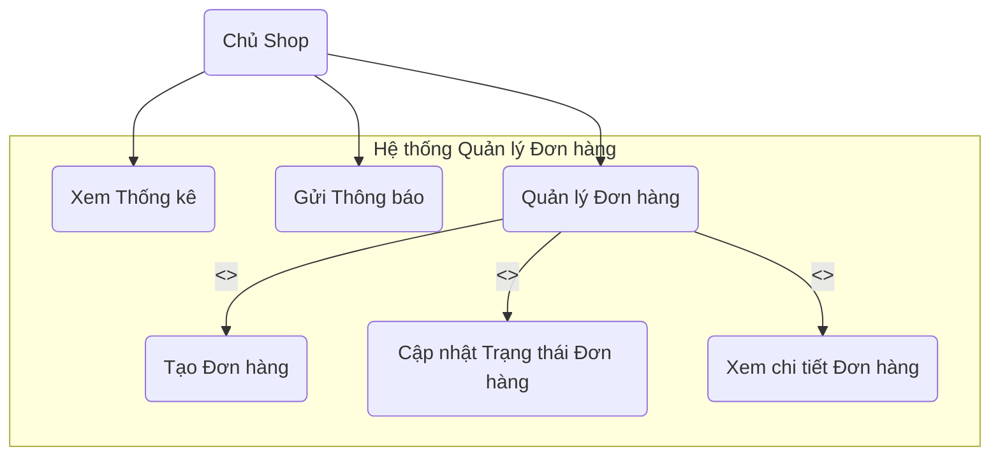
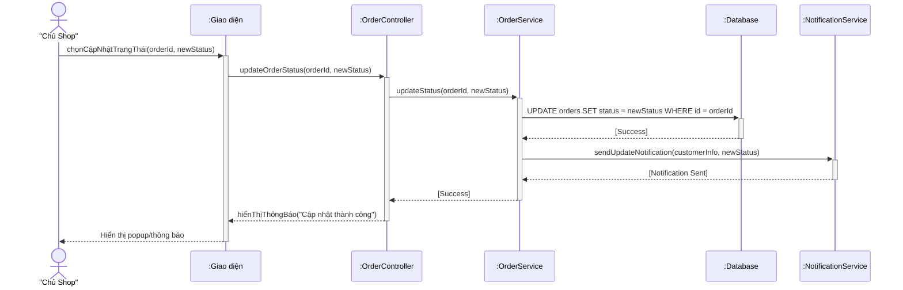

# Lab 03 - Thiết kế UML cho Mini App Quản Lý Đơn Hàng

Tài liệu này trình bày thiết kế UML (Use Case & Sequence Diagram) cho dự án "Mini App Quản Lý Đơn Hàng Cho Shop Online" theo yêu cầu của Lab 03.

## 1. Sơ đồ Use Case (Use Case Diagram)

Sơ đồ này mô tả tổng quan các chức năng mà **Chủ Shop** (Actor) có thể thực hiện trên hệ thống.



## 2. Sơ đồ Tuần tự (Sequence Diagram)

Quy trình nghiệp vụ được chọn để mô tả chi tiết là: **"Cập nhật trạng thái vận chuyển của đơn hàng"**.

Sơ đồ mô tả luồng tương tác chi tiết giữa các đối tượng trong hệ thống khi Chủ Shop thực hiện chức năng này.

#### Các đối tượng tham gia:
* **:Chủ Shop**: Người dùng cuối, người bắt đầu tương tác.
* **:Giao diện (UI)**: Lớp giao diện người dùng mà Chủ Shop tương tác.
* **:OrderController**: Lớp điều khiển, nhận yêu cầu từ giao diện.
* **:OrderService**: Lớp xử lý logic nghiệp vụ chính.
* **:Database**: Cơ sở dữ liệu lưu trữ thông tin.
* **:NotificationService**: Dịch vụ chịu trách nhiệm gửi thông báo đến khách hàng.



## 3. Hướng dẫn sử dụng Git và GitHub cơ bản

Đây là các bước cơ bản để làm việc với Git và đưa mã nguồn/tài liệu lên một repository trên GitHub.

#### Bước 1: Cài đặt Git
- Tải và cài đặt Git từ trang chủ: [git-scm.com](https://git-scm.com/downloads)

#### Bước 2: Cấu hình Git lần đầu
Mở terminal (hoặc Git Bash trên Windows) và chạy hai lệnh sau để Git biết bạn là ai:
```bash
git config --global user.name "Your Name"
git config --global user.email "your.email@example.com"
```

#### Bước 3: Sao chép Repository về máy (Clone)
Để lấy một repository đã có trên GitHub về máy tính của bạn:
```bash
git clone <URL_CUA_REPOSITORY>
```
*Ví dụ:* `git clone https://github.com/Andlpde150032/Documentary_DKN.git`

#### Bước 4: Quy trình làm việc cơ bản
Sau khi đã thay đổi (thêm, sửa, xóa file) trong thư mục dự án:
1.  **Kiểm tra trạng thái:** Xem những file nào đã bị thay đổi.
    ```bash
    git status
    ```
2.  **Đưa các thay đổi vào "staging area":** Chuẩn bị cho việc commit.
    ```bash
    # Thêm một file cụ thể
    git add ten_file.txt

    # Hoặc thêm tất cả các file đã thay đổi
    git add .
    ```
3.  **Lưu các thay đổi vào lịch sử (Commit):** Ghi lại các thay đổi vào phiên bản cục bộ. Luôn đính kèm một tin nhắn mô tả rõ ràng.
    ```bash
    git commit -m "Nội dung mô tả cho thay đổi, ví dụ: Hoan thanh Lab 03"
    ```
4.  **Đẩy các thay đổi lên GitHub (Push):** Cập nhật repository trên GitHub với những gì bạn đã commit.
    ```bash
    git push origin main
    ```
    *(Lưu ý: Tên nhánh chính có thể là `main` hoặc `master` tùy vào repository của bạn)*